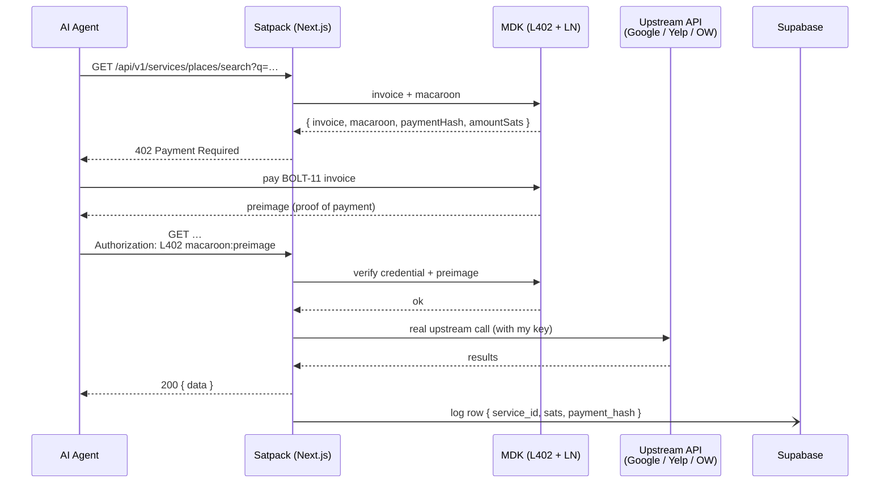

# Satpack

> **APIs your agents can buy.** AI agents can't pass KYC. Can't get a Stripe
> account. Can't sign up for Google Cloud. Satpack lets them pay 10–50 sats
> per call instead — settled instantly over Bitcoin Lightning.

Built for the **Spiral × Hack-Nation "Earn in the Agent Economy"** challenge
at MIT (April 2026).

- 🌐 Landing: `/`
- 📈 Live dashboard: `/dashboard`
- 📦 Machine-readable catalog: `/api/v1/catalog`
- 🤖 LLM-friendly index: `/api/v1/llms.txt`

## Why Lightning, not Stripe

Stripe's ~50¢ minimum fee makes a 5¢ API call economically impossible.
Lightning settles a 10-sat invoice in milliseconds for fractions of a cent
in fees. Per-call pricing has been a fantasy on traditional rails for
fifteen years; Lightning makes it trivial. **That's the whole reason this
marketplace exists.**

## How it works

Satpack is a thin operator on top of a few popular APIs (Google Places, Yelp,
OpenWeather). I hold the upstream credentials. Agents pay sats per call via
the [L402 protocol](https://github.com/lightninglabs/L402) — HTTP 402 +
Bitcoin Lightning + a signed macaroon credential.



Macaroon/preimage cryptography is fully handled by
[Money Dev Kit](https://moneydevkit.com) (`@moneydevkit/nextjs`). Each
service handler is just `withPayment({ amount, currency }, handler)` — the
plumbing is invisible.

## Available services

| ID | Price | Endpoint |
|---|---|---|
| `places.search` | 50 sats | `GET /api/v1/services/places/search?q=&near=&limit=` |
| `weather.current` | 10 sats | `GET /api/v1/services/weather/current?location=` |
| `yelp.search` | 40 sats | `GET /api/v1/services/yelp/search?term=&location=&limit=` |

All three return clean, agent-friendly JSON. When upstream API keys are not
configured locally, handlers fall back to fixture data so the dev path is
never blocked.

## Quick start

```bash
git clone https://github.com/eteen12/satpack.git
cd satpack
npm install
cp .env.example .env.local
```

Then populate `.env.local` (see [Environment](#environment) below) and run:

```bash
npm run dev
```

### 1 — Money Dev Kit credentials

Generate a self-custodial Lightning wallet + access token:

```bash
npx @moneydevkit/create --webhook-url=$APP_URL
```

`$APP_URL` must be a publicly reachable URL — MDK's hosted infrastructure
calls back to your `/api/mdk` route to spin up the merchant Lightning node.
For local dev, use ngrok:

```bash
ngrok http 3000   # copy the https URL into APP_URL in .env.local
```

Then re-run the MDK CLI. Use `printf` (not `echo`) when manually setting
`MDK_ACCESS_TOKEN` / `MDK_MNEMONIC` — trailing newlines silently break MDK
auth.

### 2 — Supabase (call logging + dashboard)

Create a project at [supabase.com](https://supabase.com), then in the SQL
editor paste and run [`supabase/schema.sql`](./supabase/schema.sql). It
creates one table (`calls`) with two indexes. No RLS — hackathon scope.

Copy `Project URL`, `anon` key, and `service_role` key into `.env.local` as
`NEXT_PUBLIC_SUPABASE_URL`, `NEXT_PUBLIC_SUPABASE_ANON_KEY`, and
`SUPABASE_SERVICE_ROLE_KEY`. The service-role key is server-only and is
guarded by a `server-only` import in `lib/supabase.ts` — it cannot leak to
the browser.

### 3 — Upstream API keys (optional)

Each service falls back to fixture data when its key is unset, so you can
run the full L402 flow end-to-end without any upstream key. To use real
data:

- `GOOGLE_PLACES_API_KEY` — from [Google Cloud Console](https://console.cloud.google.com/) → Maps Platform → Places API
- `OPENWEATHER_API_KEY` — from [openweathermap.org/api](https://openweathermap.org/api)
- `YELP_API_KEY` — from [yelp.com/developers](https://www.yelp.com/developers)

## Environment

```env
# Lightning paywall (server only)
MDK_ACCESS_TOKEN=
MDK_MNEMONIC=

# Public base URL — MDK calls back here on /api/mdk
APP_URL=

# Supabase — call logging + dashboard
NEXT_PUBLIC_SUPABASE_URL=
NEXT_PUBLIC_SUPABASE_ANON_KEY=
SUPABASE_SERVICE_ROLE_KEY=

# Upstream APIs — fixtures used when blank
GOOGLE_PLACES_API_KEY=
OPENWEATHER_API_KEY=
YELP_API_KEY=
```

See [`.env.example`](./.env.example) for the canonical template.

## Test the L402 flow end-to-end

```bash
# 1. unauthenticated request returns 402 + invoice
curl -i 'http://localhost:3000/api/v1/services/places/search?q=coffee&near=MIT'

# 2. pay the invoice from any Lightning wallet
#    (e.g. coinos.io, Phoenix, Wallet of Satoshi)
#    capture the 64-char hex preimage the wallet returns

# 3. retry with the credential
curl -i 'http://localhost:3000/api/v1/services/places/search?q=coffee&near=MIT' \
  -H 'Authorization: L402 <macaroon-from-step-1>:<preimage-from-step-2>'

# expect HTTP 200 with the JSON results
```

Visit `/dashboard` while the request is in flight to watch the totals tick
up live (3-second auto-refresh).

## Tech stack

- **Framework:** Next.js 16 (App Router, Turbopack)
- **Language:** TypeScript (strict)
- **Lightning paywall:** [`@moneydevkit/nextjs`](https://www.npmjs.com/package/@moneydevkit/nextjs) — `withPayment({ amount, currency }, handler)`
- **Database:** Supabase (logging only)
- **Styling:** Tailwind v4 (no UI library)
- **Hosting:** Vercel (Fluid Compute defaults)

## Repo layout

```
app/
  page.tsx                                 # landing
  dashboard/page.tsx + Live.tsx            # live dashboard (3s auto-refresh)
  api/mdk/route.ts                         # MDK unified webhook (re-export)
  api/v1/catalog/route.ts                  # JSON catalog
  api/v1/llms.txt/route.ts                 # markdown index for AI agents
  api/v1/services/places/search/route.ts   # 50 sats
  api/v1/services/weather/current/route.ts # 10 sats
  api/v1/services/yelp/search/route.ts     # 40 sats
  api/dashboard/stats/route.ts             # JSON stats for the dashboard poller
lib/
  catalog.ts                               # CATALOG single source of truth
  supabase.ts                              # server-only client + logCall + extractPaymentHash
  services/places.ts | weather.ts | yelp.ts  # upstream callers + fixtures
types/
  catalog.ts | dashboard.ts                # shared types (no runtime)
supabase/schema.sql                        # paste into the Supabase SQL editor
```

## Out of scope (explicitly cut)

- Authentication / user accounts (agents don't have them)
- Provider onboarding (V2 — third parties listing their own services)
- Rate limiting, caching, retry queues
- Tests beyond `curl` smoke checks

## Credits

Built by [@eteen12](https://github.com/eteen12) for the
[Spiral × Hack-Nation](https://hack-nation.ai/) "Earn in the Agent Economy"
challenge at MIT, April 2026.

Lightning paywall powered by [Money Dev Kit](https://moneydevkit.com). L402
protocol by [Lightning Labs](https://github.com/lightninglabs/L402).
